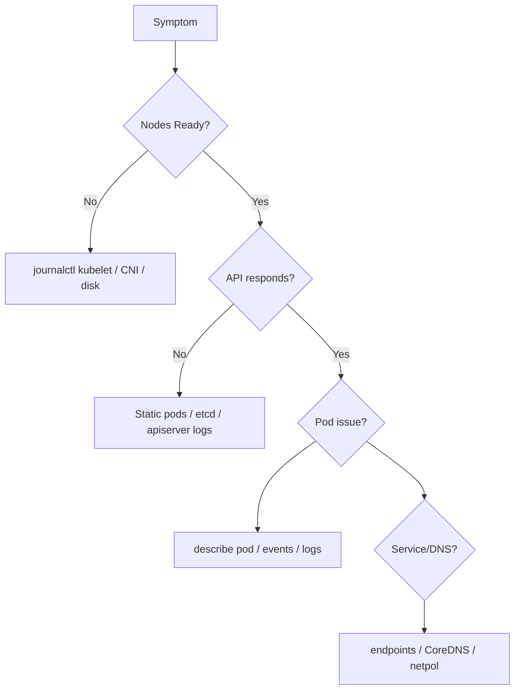

# CKA Master Handbook & Study Guide

**Certified Kubernetes Administrator (CKA)** — From Terminal Basics to Enterprise Operations

| Document | Version | Audience |
|----------|---------|----------|
| CKA Master Guide | 1.0 | CKA candidates, platform engineers, SREs |

> **Exam mindset:** The CKA is a performance exam. Speed, accuracy, and systematic troubleshooting beat memorizing trivia. This guide pairs every concept with **Definition**, **Real-world Purpose**, **CLI Command**, **Complete Working YAML** (where applicable), and **Execution Steps**.

---

## Table of Contents

1. [Module 1: Terminal Speed & Exam Ergonomics](#module-1-terminal-speed--exam-ergonomics)
2. [Module 2: Kubernetes Architecture & Core Workloads](#module-2-kubernetes-architecture--core-workloads)
3. [Module 3: Scheduling & Node Selection](#module-3-scheduling--node-selection-deep-dive)
4. [Module 4: Cluster Maintenance & Control Plane Operations](#module-4-cluster-maintenance--control-plane-operations)
5. [Module 5: Storage Architecture](#module-5-storage-architecture)
6. [Module 6: Networking, Services & Security](#module-6-networking-services--security)
7. [Module 7: Enterprise Troubleshooting Workflows](#module-7-enterprise-troubleshooting-workflows)
8. [Module 8: 48-Hour Hands-On Practice Drill Schedule](#module-8-48-hour-hands-on-practice-drill-schedule)

---

## Module 1: Terminal Speed & Exam Ergonomics

### 1.1 Shell Aliases and Exports

#### Definition

Short-lived shell configuration (`alias`, `export`) that maps frequent `kubectl` patterns to single keystrokes and enables client-side dry-run YAML generation.

#### Real-world Purpose

Exam tasks often require creating or editing manifests under time pressure. Aliases reduce typos and copy-paste errors; `--dry-run=client -o yaml` produces API-valid stubs without touching the cluster.

#### CLI Command

```bash
# Add to ~/.bashrc or exam shell profile
alias k='kubectl'
alias kg='kubectl get'
alias kd='kubectl describe'
alias kdel='kubectl delete'
export do='--dry-run=client -o yaml'
export now='--force --grace-period=0'

# Regenerate stub manifests
k run nginx --image=nginx $do > pod.yaml
k create deployment web --image=nginx --replicas=3 $do > deploy.yaml
```

#### Complete Working YAML

Not applicable (shell configuration only).

#### Execution Steps

1. Append aliases to `~/.bashrc`.
2. Run `source ~/.bashrc`.
3. Verify: `k version --client` and `k run test --image=nginx $do | head`.

---

### 1.2 Bash kubectl Completion

#### Definition

Dynamic tab completion for `kubectl` subcommands, resources, and flags via the bash completion script shipped with `kubectl`.

#### Real-world Purpose

Reduces cognitive load during the exam; completion surfaces correct resource names and namespaces.

#### CLI Command

```bash
source <(kubectl completion bash)
echo 'source <(kubectl completion bash)' >> ~/.bashrc
complete -F __start_kubectl k   # if using alias k
```

#### Complete Working YAML

Not applicable.

#### Execution Steps

1. Ensure `kubectl` is in `PATH`.
2. Source completion once per session or persist in `.bashrc`.
3. Type `kubectl get po` + Tab to verify pod name completion.

---

### 1.3 Vim Exam Optimization (`.vimrc`)

#### Definition

Editor settings that align YAML indentation with Kubernetes conventions (2-space indents, no tabs).

#### Real-world Purpose

Mis-indented YAML fails API validation; consistent editing speed matters when patching manifests in Vim.

#### CLI Command

```bash
cat >> ~/.vimrc <<'EOF'
set expandtab
set tabstop=2
set shiftwidth=2
set number
syntax on
EOF
```

#### Complete Working YAML

Not applicable.

#### Execution Steps

1. Create or edit `~/.vimrc`.
2. Open a manifest: `vim pod.yaml`.
3. Press `gg=G` to auto-indent the file if pasted from elsewhere.

---

### 1.4 Rapid Imperative Generation Matrix

Each row: generate stub → edit → apply.

| Resource | Imperative stub command |
|----------|-------------------------|
| Pod | `k run nginx --image=nginx $do` |
| Deployment | `k create deployment web --image=nginx --replicas=3 $do` |
| Service | `k expose deployment web --port=80 --target-port=8080 $do` |
| ConfigMap | `k create configmap app-config --from-literal=KEY=val $do` |
| Secret | `k create secret generic db --from-literal=password=s3cr3t $do` |
| Job | `k create job pi --image=perl -- perl -Mbignum=bpi -wle 'print bpi(2000)' $do` |
| CronJob | `k create cronjob hello --image=busybox --schedule="*/5 * * * *" -- echo hi $do` |
| ServiceAccount | `k create serviceaccount app-sa $do` |
| Role | `k create role pod-reader --verb=get,list,watch --resource=pods $do` |
| RoleBinding | `k create rolebinding read-pods --role=pod-reader --serviceaccount=default:app-sa $do` |

#### Definition

Client-side dry-run commands that emit canonical API objects for rapid customization.

#### Real-world Purpose

Faster than writing YAML from scratch; ensures correct `apiVersion`/`kind` fields for the target cluster version.

#### CLI Command

```bash
k create deployment api --image=nginx:1.25 $do > deploy.yaml
# Edit deploy.yaml, then:
k apply -f deploy.yaml
```

#### Complete Working YAML (Deployment example after edit)

```yaml
apiVersion: apps/v1
kind: Deployment
metadata:
  name: api
  labels:
    app: api
spec:
  replicas: 2
  selector:
    matchLabels:
      app: api
  template:
    metadata:
      labels:
        app: api
    spec:
      containers:
        - name: nginx
          image: nginx:1.25
          ports:
            - containerPort: 80
```

#### Execution Steps

1. Run imperative dry-run command.
2. Redirect to file; edit labels, probes, resources.
3. `kubectl apply -f` and `kubectl rollout status deployment/api`.

---

### 1.5 JSONPath Filtering Patterns

#### Definition

`kubectl` custom columns and `-o jsonpath` queries over the Kubernetes API object graph.

#### Real-world Purpose

Extract node IPs, pod phases, or sort-by-time without external tools—common in exam troubleshooting tasks.

#### CLI Command

```bash
# All node internal IPs
kubectl get nodes -o jsonpath='{range .items[*]}{.metadata.name}{"\t"}{.status.addresses[?(@.type=="InternalIP")].address}{"\n"}{end}'

# Pods not Running
kubectl get pods -A -o jsonpath='{range .items[?(@.status.phase!="Running")]}{.metadata.namespace}/{.metadata.name}{"\t"}{.status.phase}{"\n"}{end}'

# Custom columns + sort by creation timestamp
kubectl get pods -A --sort-by=.metadata.creationTimestamp \
  -o custom-columns=NS:.metadata.namespace,NAME:.metadata.name,AGE:.metadata.creationTimestamp,STATUS:.status.phase
```

#### Complete Working YAML

Not applicable.

#### Execution Steps

1. Identify the JSON field via `kubectl get pod <name> -o yaml`.
2. Craft jsonpath; test on one object.
3. Wrap in script or one-liner for exam checklist.

---

### 1.6 Workload Stubs: Job, CronJob, RBAC Objects

#### Job

**Definition:** Run-to-completion workload; pod restart policy `OnFailure` or `Never`.

**Real-world Purpose:** Batch ETL, migrations, one-off admin tasks.

**CLI Command:** `k create job batch --image=busybox -- echo done $do > job.yaml`

**Complete Working YAML:**

```yaml
apiVersion: batch/v1
kind: Job
metadata:
  name: batch
spec:
  completions: 1
  parallelism: 1
  template:
    spec:
      restartPolicy: Never
      containers:
        - name: worker
          image: busybox
          command: ["sh", "-c", "echo complete; sleep 2"]
```

**Execution Steps:** Apply; wait for `Complete`; inspect `kubectl logs job/batch`.

#### CronJob

**Definition:** Time-based Job scheduler using cron syntax.

**Real-world Purpose:** Nightly reports, certificate checks, cache warming.

**CLI Command:** `k create cronjob nightly --image=busybox --schedule='0 2 * * *' -- echo run $do`

**Complete Working YAML:**

```yaml
apiVersion: batch/v1
kind: CronJob
metadata:
  name: nightly
spec:
  schedule: "0 2 * * *"
  jobTemplate:
    spec:
      template:
        spec:
          restartPolicy: OnFailure
          containers:
            - name: task
              image: busybox
              command: ["sh", "-c", "date; echo nightly"]
```

**Execution Steps:** Apply; `kubectl get cj,job,pods`; suspend with `kubectl patch cronjob nightly -p '{"spec":{"suspend":true}}'`.

#### ServiceAccount, Role, RoleBinding (namespace scoped)

**Definition:** Identity (SA) plus permission template (Role) and assignment (RoleBinding).

**Real-world Purpose:** In-cluster apps that call the API with minimal verbs.

**CLI Command:**

```bash
k create sa app-sa $do
k create role pod-reader --verb=get,list,watch --resource=pods $do
k create rolebinding bind-reader --role=pod-reader --serviceaccount=default:app-sa $do
```

**Complete Working YAML:** See Module 6 RBAC section for the bound trio.

**Execution Steps:** Apply all three; test with `kubectl auth can-i list pods --as=system:serviceaccount:default:app-sa`.

---

## Module 2: Kubernetes Architecture & Core Workloads

### 2.1 Control Plane Components

| Component | Definition | Real-world Purpose |
|-----------|------------|-------------------|
| **kube-apiserver** | Front door REST API; validates and persists objects to etcd | All automation and `kubectl` traffic flows here; HA via multiple instances behind load balancer |
| **etcd** | Consistent key-value store for cluster state | Backup/restore target; corruption or quorum loss stops the cluster |
| **kube-scheduler** | Assigns pods to nodes via filters and scores | Capacity, affinity, taints, and custom schedulers affect placement |
| **kube-controller-manager** | Runs controllers (Deployment, Node, Job, etc.) | Reconciliation loops maintain desired state |
| **kubelet** | Node agent; runs pods via CRI | Node NotReady often traces to kubelet or CNI |
| **kube-proxy** | Programs node networking for Services (iptables/IPVS/eBPF) | Service VIP reachability depends on kube-proxy/CNI integration |

#### CLI Command

```bash
kubectl get pods -n kube-system
kubectl get componentstatuses 2>/dev/null || kubectl get --raw='/readyz?verbose'
crictl ps | grep kube
```

#### Complete Working YAML

Not applicable (static pods on control plane nodes—see Module 3 Static Pods).

#### Execution Steps

1. On control plane: verify static pod manifests under `/etc/kubernetes/manifests/`.
2. Check `kubectl get nodes` and kube-system pod health.
3. Correlate API errors with apiserver/etcd logs.

---

### 2.2 Pod Lifecycle States

#### Definition

| Phase | Meaning |
|-------|---------|
| **Pending** | Scheduled but not all containers running (scheduling, image pull, volumes) |
| **Running** | At least one container running |
| **Succeeded** | All containers terminated successfully (Jobs) |
| **Failed** | At least one container failed |
| **Unknown** | Node communication lost |
| **CrashLoopBackOff** | Container exits; kubelet backs off restarts |
| **ImagePullBackOff** | Registry auth, wrong tag, or network block |

#### Real-world Purpose

Phase drives troubleshooting: events → describe → logs.

#### CLI Command

```bash
kubectl get pods -w
kubectl describe pod <name>
kubectl logs <pod> -c <container> --previous
```

#### Complete Working YAML

```yaml
apiVersion: v1
kind: Pod
metadata:
  name: lifecycle-demo
spec:
  restartPolicy: Never
  containers:
    - name: succeed
      image: busybox
      command: ["sh", "-c", "echo ok; exit 0"]
```

#### Execution Steps

1. Apply pod; observe `Succeeded`.
2. Change command to `exit 1`; observe `Failed`.
3. Set `restartPolicy: Always` and failing command; observe `CrashLoopBackOff`.

---

### 2.3 Multi-Container Patterns (Sidecar, Ambassador, Adapter)

#### Definition

- **Sidecar:** Helper container in same pod (logging, proxy, sync).
- **Ambassador:** Proxy container exposing local service to the pod network.
- **Adapter:** Transforms output/metrics from main container.

#### Real-world Purpose

Sidecars share network namespace and volumes—classic for log shipping and service mesh data planes.

#### CLI Command

```bash
kubectl apply -f sidecar-emptydir.yaml
kubectl logs lifecycle-demo -c log-shipper
kubectl exec lifecycle-demo -c app -- cat /var/log/app.log
```

#### Complete Working YAML (Sidecar + `emptyDir`)

```yaml
apiVersion: v1
kind: Pod
metadata:
  name: sidecar-demo
spec:
  containers:
    - name: app
      image: busybox
      command: ["sh", "-c", "while true; do echo $(date) app-log; sleep 5; done >> /var/log/app.log"]
      volumeMounts:
        - name: logs
          mountPath: /var/log
    - name: log-shipper
      image: busybox
      command: ["sh", "-c", "tail -F /var/log/app.log"]
      volumeMounts:
        - name: logs
          mountPath: /var/log
  volumes:
    - name: logs
      emptyDir: {}
```

#### Execution Steps

1. Apply manifest.
2. Confirm sidecar streams app logs.
3. Delete pod; note `emptyDir` data is ephemeral.

#### Ambassador Pattern (`emptyDir` + local proxy)

**Definition:** A container proxies traffic to a process bound on `localhost` in another container within the pod.

**Real-world Purpose:** Legacy apps listening only on `127.0.0.1` can still receive cluster traffic via the ambassador container.

**CLI Command:**

```bash
kubectl apply -f ambassador-emptydir.yaml
kubectl exec ambassador-demo -c ambassador -- wget -qO- http://127.0.0.1:8080
```

**Complete Working YAML:**

```yaml
apiVersion: v1
kind: Pod
metadata:
  name: ambassador-demo
spec:
  containers:
    - name: legacy
      image: busybox
      command: ["sh", "-c", "while true; do echo HTTP/1.0 200 OK; sleep 30; done | nc -l -p 9000"]
    - name: ambassador
      image: nginx:alpine
      ports:
        - containerPort: 8080
      volumeMounts:
        - name: shared
          mountPath: /etc/nginx/conf.d
  volumes:
    - name: shared
      emptyDir: {}
```

**Execution Steps:** Deploy; port-forward `8080`; verify ambassador exposes the legacy socket indirectly (in production, mount generated nginx config into `emptyDir` from an init container).

#### Adapter Pattern (`emptyDir` metrics normalization)

**Definition:** A container reads raw output from a shared volume and exposes a normalized format for scrapers.

**Real-world Purpose:** Prometheus adapters, log format converters, and legacy metric bridges without changing the primary application binary.

**CLI Command:**

```bash
kubectl apply -f adapter-emptydir.yaml
kubectl logs adapter-demo -c adapter -f
```

**Complete Working YAML:**

```yaml
apiVersion: v1
kind: Pod
metadata:
  name: adapter-demo
spec:
  containers:
    - name: app
      image: busybox
      command: ["sh", "-c", "while true; do echo 'raw_metric=42'; sleep 3; done > /data/out.prom"]
      volumeMounts:
        - name: metrics
          mountPath: /data
    - name: adapter
      image: busybox
      command: ["sh", "-c", "while true; do sed 's/raw_/normalized_/g' /data/out.prom; sleep 3; done"]
      volumeMounts:
        - name: metrics
          mountPath: /data
  volumes:
    - name: metrics
      emptyDir: {}
```

**Execution Steps:** Apply; confirm adapter logs show transformed lines; delete pod to reset ephemeral storage.

---

### 2.4 Init Containers

#### Definition

Containers that run sequentially before app containers start; each must succeed unless `restartPolicy` dictates otherwise.

#### Real-world Purpose

Migrations, config download, or wait-for dependency before main app starts.

#### CLI Command

```bash
kubectl apply -f init-demo.yaml
kubectl describe pod init-demo | grep -A20 Init
```

#### Complete Working YAML

```yaml
apiVersion: v1
kind: Pod
metadata:
  name: init-demo
spec:
  initContainers:
    - name: wait-db
      image: busybox
      command: ["sh", "-c", "until nslookup db.default; do sleep 1; done"]
  containers:
    - name: app
      image: nginx
```

#### Execution Steps

1. Apply without `db` service; init hangs in `Init:0/1`.
2. Create headless Service `db`; init completes; pod reaches `Running`.
3. Fail an init container; observe pod does not start app container.

---

### 2.5 Deployments: Strategy, Rollouts, Rollbacks

#### Definition

Deployment controller manages ReplicaSets. Strategies: **RollingUpdate** (default) vs **Recreate**. `maxSurge` / `maxUnavailable` bound disruption during rollouts.

#### Real-world Purpose

Zero-downtime image upgrades; controlled blast radius; revision history for rollback.

#### CLI Command

```bash
kubectl set image deployment/web nginx=nginx:1.26 --record
kubectl rollout status deployment/web
kubectl rollout history deployment/web
kubectl rollout undo deployment/web --to-revision=2
kubectl patch deployment web -p '{"spec":{"strategy":{"type":"Recreate"}}}'
```

#### Complete Working YAML

```yaml
apiVersion: apps/v1
kind: Deployment
metadata:
  name: web
spec:
  replicas: 4
  strategy:
    type: RollingUpdate
    rollingUpdate:
      maxSurge: 1
      maxUnavailable: 1
  selector:
    matchLabels:
      app: web
  template:
    metadata:
      labels:
        app: web
    spec:
      containers:
        - name: nginx
          image: nginx:1.25
          ports:
            - containerPort: 80
```

#### Execution Steps

1. Apply deployment; note ReplicaSet revision 1.
2. Update image; watch new ReplicaSet scale up.
3. `kubectl rollout undo` to prior revision; verify pods revert image.

---

## Module 3: Scheduling & Node Selection (Deep Dive)

### 3.1 Scheduler Filtering and Scoring

#### Definition

**Filtering:** Eliminate nodes that violate hard constraints (resources, taints, nodeSelector, affinity). **Scoring:** Rank feasible nodes; highest score wins.

#### Real-world Purpose

Predict pod placement; debug "Pending" due to insufficient CPU or untolerated taints.

#### CLI Command

```bash
kubectl describe pod <pending-pod> | grep -A5 Events
kubectl get events --sort-by=.lastTimestamp
# Verbose scheduler logs (if enabled on control plane)
```

#### Complete Working YAML

See taints/affinity examples below.

#### Execution Steps

1. Identify `FailedScheduling` event message.
2. Check node capacity: `kubectl describe node`.
3. Adjust requests, tolerations, or affinity.

---

### 3.2 Labels, Selectors, NodeSelector

#### Definition

Labels are key/value metadata; selectors choose objects. `nodeSelector` is the simplest scheduling constraint on node labels.

#### Real-world Purpose

Route GPU workloads to GPU nodes; segregate environments.

#### CLI Command

```bash
kubectl label nodes node1 disktype=ssd
kubectl get nodes -l disktype=ssd
```

#### Complete Working YAML

```yaml
apiVersion: v1
kind: Pod
metadata:
  name: ssdpod
spec:
  nodeSelector:
    disktype: ssd
  containers:
    - name: app
      image: nginx
```

#### Execution Steps

1. Label at least one node.
2. Apply pod; verify placement with `-o wide`.
3. Remove label; pod stays running but rescheduling on delete respects new rules.

---

### 3.3 Taints and Tolerations

#### Definition

| Effect | Behavior |
|--------|----------|
| **NoSchedule** | New pods without toleration not scheduled |
| **PreferNoSchedule** | Soft avoid |
| **NoExecute** | Evict existing pods without toleration after `tolerationSeconds` |

#### Real-world Purpose

Dedicated system nodes, batch vs latency-sensitive separation.

#### CLI Command

```bash
kubectl taint nodes node1 dedicated=special:NoSchedule
kubectl taint nodes node1 dedicated=special:NoSchedule-
```

#### Complete Working YAML

```yaml
apiVersion: v1
kind: Pod
metadata:
  name: tolerated
spec:
  tolerations:
    - key: dedicated
      operator: Equal
      value: special
      effect: NoSchedule
  containers:
    - name: app
      image: nginx
```

#### Execution Steps

1. Taint node; generic pod stays Pending.
2. Apply tolerated pod; schedules successfully.
3. Change to `NoExecute`; observe eviction behavior.

---

### 3.4 Node Affinity and Anti-Affinity

#### Definition

**Hard:** `requiredDuringSchedulingIgnoredDuringExecution`. **Soft:** `preferredDuringSchedulingIgnoredDuringExecution` with weights.

#### Real-world Purpose

Co-locate with SSD nodes (hard) or prefer a zone (soft).

#### CLI Command

```bash
kubectl apply -f node-affinity.yaml
kubectl get pod -o wide
```

#### Complete Working YAML

```yaml
apiVersion: v1
kind: Pod
metadata:
  name: node-affinity-demo
spec:
  affinity:
    nodeAffinity:
      requiredDuringSchedulingIgnoredDuringExecution:
        nodeSelectorTerms:
          - matchExpressions:
              - key: kubernetes.io/hostname
                operator: In
                values:
                  - node1
  containers:
    - name: app
      image: nginx
```

#### Execution Steps

1. Adjust hostname to match your cluster node name.
2. Apply; confirm scheduling or intentional Pending.
3. Add preferred rules and compare placement distribution.

---

### 3.5 Pod Affinity and Pod Anti-Affinity

#### Definition

Schedule relative to other pods' labels/topology keys (`kubernetes.io/hostname`, `topology.kubernetes.io/zone`).

#### Real-world Purpose

Spread replicas across hosts (anti-affinity) or co-locate cache with app (affinity).

#### CLI Command

```bash
kubectl apply -f pod-anti-affinity.yaml
kubectl get pods -o wide -l app=web
```

#### Complete Working YAML

```yaml
apiVersion: apps/v1
kind: Deployment
metadata:
  name: web-spread
spec:
  replicas: 3
  selector:
    matchLabels:
      app: web
  template:
    metadata:
      labels:
        app: web
    spec:
      affinity:
        podAntiAffinity:
          requiredDuringSchedulingIgnoredDuringExecution:
            - labelSelector:
                matchLabels:
                  app: web
              topologyKey: kubernetes.io/hostname
      containers:
        - name: nginx
          image: nginx
```

#### Execution Steps

1. Apply with 3 replicas and ≥3 nodes for success.
2. On 2-node cluster, expect Pending—switch to `preferred` or reduce replicas.
3. Verify one pod per hostname.

---

### 3.6 Static Pods

#### Definition

Pods managed directly by kubelet from manifest files on the node; API server mirrors them but cannot delete the pod object permanently (kubelet recreates).

#### Real-world Purpose

Self-healing control plane components in kubeadm clusters.

#### CLI Command

```bash
# On node (exam lab)
sudo ls /etc/kubernetes/manifests/
sudo crictl ps | grep kube-apiserver
kubectl get pods -n kube-system | grep node-name
```

#### Complete Working YAML (place on node at `/etc/kubernetes/manifests/static-nginx.yaml`)

```yaml
apiVersion: v1
kind: Pod
metadata:
  name: static-nginx
  namespace: kube-system
spec:
  containers:
    - name: nginx
      image: nginx
```

#### Execution Steps

1. Copy manifest to manifests directory on a worker (lab only).
2. Kubelet creates pod; visible via `kubectl`.
3. `kubectl delete pod` — pod reappears; remove file to stop.

---

### 3.7 Custom Schedulers

#### Definition

Alternate scheduler binary or profile selected via `spec.schedulerName`.

#### Real-world Purpose

Batch workloads, GPU packing, or policy engines beyond default scheduler.

#### CLI Command

```bash
kubectl apply -f custom-scheduler.yaml
kubectl apply -f pod-custom-scheduler.yaml
kubectl describe pod gpu-job | grep Scheduler
```

#### Complete Working YAML (scheduler Deployment + pod)

```yaml
apiVersion: v1
kind: ServiceAccount
metadata:
  name: my-scheduler
  namespace: kube-system
---
apiVersion: rbac.authorization.k8s.io/v1
kind: ClusterRoleBinding
metadata:
  name: my-scheduler-as-kube-scheduler
roleRef:
  apiGroup: rbac.authorization.k8s.io
  kind: ClusterRole
  name: system:kube-scheduler
subjects:
  - kind: ServiceAccount
    name: my-scheduler
    namespace: kube-system
---
apiVersion: apps/v1
kind: Deployment
metadata:
  name: my-scheduler
  namespace: kube-system
spec:
  replicas: 1
  selector:
    matchLabels:
      app: my-scheduler
  template:
    metadata:
      labels:
        app: my-scheduler
    spec:
      serviceAccountName: my-scheduler
      containers:
        - name: kube-scheduler
          image: registry.k8s.io/kube-scheduler:v1.29.0
          command:
            - kube-scheduler
            - --config=/etc/kubernetes/my-scheduler-config.yaml
            - --leader-elect=false
          volumeMounts:
            - name: config
              mountPath: /etc/kubernetes
      volumes:
        - name: config
          configMap:
            name: my-scheduler-config
---
apiVersion: v1
kind: Pod
metadata:
  name: use-custom-scheduler
spec:
  schedulerName: my-scheduler
  containers:
    - name: app
      image: nginx
```

#### Execution Steps

1. Deploy scheduler with correct image version matching cluster.
2. Create ConfigMap for scheduler config (profiles) in real clusters.
3. Schedule test pod; verify `schedulerName` in spec.

---

## Module 4: Cluster Maintenance & Control Plane Operations

### 4.1 Cordon, Uncordon, Drain

#### Definition

- **Cordon:** Mark node unschedulable (`spec.unschedulable=true`).
- **Uncordon:** Reverse cordon.
- **Drain:** Evict workloads respecting PDBs; optional emptyDir deletion.

#### Real-world Purpose

Safe node maintenance, kernel upgrades, autoscaling scale-down.

#### CLI Command

```bash
kubectl cordon node1
kubectl drain node1 --ignore-daemonsets --delete-emptydir-data --force
kubectl uncordon node1
```

#### Complete Working YAML

Not applicable (operational commands).

#### Execution Steps

1. Cordon; verify new pods not placed on node.
2. Drain; watch pods reschedule.
3. Perform maintenance; uncordon.

---

### 4.2 kubeadm Cluster Upgrade (Control Plane + Workers)

#### Definition

Version-aligned upgrade of control plane components via `kubeadm`, then node-by-node kubelet/kubeadm upgrades.

#### Real-world Purpose

Stay within supported skew; patch CVEs; exam simulates staged upgrades.

#### CLI Command

```bash
# Control plane node (example 1.28 -> 1.29)
sudo apt-mark unhold kubeadm kubectl kubelet
sudo apt-get update && sudo apt-get install -y kubeadm=1.29.x-* kubectl=1.29.x-* kubelet=1.29.x-*
sudo kubeadm upgrade plan
sudo kubeadm upgrade apply v1.29.x
sudo systemctl daemon-reload && sudo systemctl restart kubelet

# Worker node
sudo apt-get install -y kubeadm=1.29.x-* kubelet=1.29.x-*
sudo kubeadm upgrade node
sudo systemctl daemon-reload && sudo systemctl restart kubelet
```

#### Complete Working YAML

Not applicable.

#### Execution Steps

1. Upgrade first control plane; verify `kubectl get nodes`.
2. Upgrade additional control plane members with `kubeadm upgrade node` on CP.
3. Drain → upgrade kubelet/kubeadm → uncordon each worker sequentially.

---

### 4.3 etcd Backup and Restore

#### Definition

Snapshot etcd data directory via `etcdctl snapshot save`; restore to new data dir and update static pod manifest.

#### Real-world Purpose

Disaster recovery; exam tasks test exact cert paths and `--data-dir` changes.

#### CLI Command

```bash
ETCDCTL_API=3 etcdctl snapshot save /var/lib/etcd-backup.db \
  --endpoints=https://127.0.0.1:2379 \
  --cacert=/etc/kubernetes/pki/etcd/ca.crt \
  --cert=/etc/kubernetes/pki/etcd/server.crt \
  --key=/etc/kubernetes/pki/etcd/server.key

ETCDCTL_API=3 etcdctl snapshot restore /var/lib/etcd-backup.db \
  --data-dir=/var/lib/etcd-restore

# Edit /etc/kubernetes/manifests/etcd.yaml:
#   change hostPath for etcd-data to /var/lib/etcd-restore
#   ensure --data-dir matches
sudo mv /etc/kubernetes/manifests/etcd.yaml /tmp/ && sleep 5 && sudo mv /tmp/etcd.yaml /etc/kubernetes/manifests/
```

#### Complete Working YAML (etcd static pod fragment)

```yaml
spec:
  containers:
    - name: etcd
      command:
        - etcd
        - --data-dir=/var/lib/etcd-restore
  volumes:
    - name: etcd-data
      hostPath:
        path: /var/lib/etcd-restore
        type: DirectoryOrCreate
```

#### Execution Steps

1. Stop etcd pod by moving manifest briefly (lab procedure).
2. Restore snapshot to new directory.
3. Update manifest paths; wait for kubelet to restart etcd.
4. Validate: `kubectl get nodes`, `etcdctl endpoint health`.

---

## Module 5: Storage Architecture

### 5.1 PV, PVC, StorageClass

#### Definition

| Object | Role |
|--------|------|
| **PersistentVolume (PV)** | Cluster-scoped storage asset |
| **PersistentVolumeClaim (PVC)** | Namespace-scoped request for storage |
| **StorageClass** | Dynamic provisioning template |

#### Real-world Purpose

Decouple app lifecycle from disk lifecycle; enable StatefulSets and databases.

#### CLI Command

```bash
kubectl get pv,pvc,sc
kubectl describe pvc data-claim
```

#### Complete Working YAML

End-to-end **manual/local** binding:

```yaml
apiVersion: v1
kind: PersistentVolume
metadata:
  name: pv-local
spec:
  capacity:
    storage: 1Gi
  accessModes:
    - ReadWriteOnce
  persistentVolumeReclaimPolicy: Retain
  storageClassName: manual
  hostPath:
    path: /mnt/data/pv-local
---
apiVersion: v1
kind: PersistentVolumeClaim
metadata:
  name: data-claim
spec:
  accessModes:
    - ReadWriteOnce
  resources:
    requests:
      storage: 1Gi
  storageClassName: manual
---
apiVersion: v1
kind: Pod
metadata:
  name: pv-consumer
spec:
  containers:
    - name: app
      image: nginx
      volumeMounts:
        - name: data
          mountPath: /usr/share/nginx/html
  volumes:
    - name: data
      persistentVolumeClaim:
        claimName: data-claim
```

#### Execution Steps

1. Create host path on node (for `hostPath` labs).
2. Apply PV then PVC; status `Bound`.
3. Apply pod; write file to mount; delete pod; data persists on PV.

---

### 5.2 Access Modes, Reclaim Policies, Volume Binding

#### Definition

| Access mode | Meaning |
|-------------|---------|
| **ReadWriteOnce (RWO)** | Single node read/write |
| **ReadOnlyMany (ROX)** | Many nodes read-only |
| **ReadWriteMany (RWX)** | Many nodes read/write (requires shared filesystem) |

| Reclaim | Behavior after PVC delete |
|---------|---------------------------|
| **Retain** | Manual admin reclaim |
| **Delete** | Underlying volume deleted (cloud/dynamic) |
| **Recycle** | Deprecated basic scrub |

| Binding mode | Behavior |
|--------------|----------|
| **Immediate** | PV provisioned/bound immediately |
| **WaitForFirstConsumer** | Delay until pod scheduled (topology-aware) |

#### Real-world Purpose

Match storage backend capabilities; avoid binding PV to wrong zone.

#### CLI Command

```bash
kubectl get storageclass -o custom-columns=NAME:.metadata.name,MODE:.volumeBindingMode,PROVISIONER:.provisioner
```

#### Complete Working YAML (StorageClass with WaitForFirstConsumer)

```yaml
apiVersion: storage.k8s.io/v1
kind: StorageClass
metadata:
  name: delayed
provisioner: kubernetes.io/no-provisioner
volumeBindingMode: WaitForFirstConsumer
```

#### Execution Steps

1. Compare RWO pod scheduling vs RWX requirements.
2. Delete PVC with `Retain` PV; clean up manually.
3. Create SC with `WaitForFirstConsumer`; observe PVC unbound until pod exists.

---

## Module 6: Networking, Services & Security

### 6.1 Cluster Networking Model

#### Definition

Every pod gets a cluster-routable IP. **Pod→Pod:** direct (CNI). **Pod→Service:** virtual IP via kube-proxy/CNI. **External→Service:** NodePort/LoadBalancer/Ingress.

#### Real-world Purpose

Debug DNS, NetworkPolicy, and Service misconfiguration systematically.

#### CLI Command

```bash
kubectl run tmp --image=nicolaka/netshoot -it --rm -- bash
# inside: curl, nslookup, traceroute
```

#### Complete Working YAML

See Services and NetworkPolicy below.

#### Execution Steps

1. From netshoot pod, `curl` ClusterIP Service.
2. `nslookup kubernetes.default` for DNS baseline.
3. Trace failing hop (policy vs Service endpoints).

---

### 6.2 Services: ClusterIP, NodePort, LoadBalancer

#### Definition

| Type | Exposure |
|------|----------|
| **ClusterIP** | Internal VIP only |
| **NodePort** | Static high port on all nodes |
| **LoadBalancer** | Cloud LB → NodePort/ClusterIP |

#### Real-world Purpose

Layered exposure from internal microservices to public traffic.

#### CLI Command

```bash
kubectl expose deployment web --port=80 --target-port=8080 --type=ClusterIP
kubectl expose deployment web --port=80 --type=NodePort
kubectl get svc web -o wide
kubectl get endpoints web
```

#### Complete Working YAML

```yaml
apiVersion: v1
kind: Service
metadata:
  name: web
spec:
  type: NodePort
  selector:
    app: web
  ports:
    - port: 80
      targetPort: 8080
      nodePort: 30080
```

#### Execution Steps

1. Ensure pod labels match selector.
2. `curl <node-ip>:30080`.
3. Scale deployment; endpoints update automatically.

---

### 6.3 Ingress and Ingress Controllers

#### Definition

Ingress defines HTTP/S routing rules; **Ingress Controller** (nginx, traefik) implements them.

Path types: **Prefix**, **Exact**. Annotations configure rewrite, TLS, upstream behavior.

#### Real-world Purpose

Single entry point, name-based virtual hosts, TLS termination.

#### CLI Command

```bash
kubectl get ingress
kubectl describe ingress web-ing
```

#### Complete Working YAML

```yaml
apiVersion: networking.k8s.io/v1
kind: Ingress
metadata:
  name: web-ing
  annotations:
    nginx.ingress.kubernetes.io/rewrite-target: /
spec:
  ingressClassName: nginx
  tls:
    - hosts:
        - app.example.com
      secretName: app-tls
  rules:
    - host: app.example.com
      http:
        paths:
          - path: /api
            pathType: Prefix
            backend:
              service:
                name: api
                port:
                  number: 80
          - path: /
            pathType: Prefix
            backend:
              service:
                name: web
                port:
                  number: 80
```

#### Execution Steps

1. Install ingress controller matching `ingressClassName`.
2. Create TLS secret: `kubectl create secret tls app-tls --cert=tls.crt --key=tls.key`.
3. Apply Ingress; test Host header or DNS.

---

### 6.4 NetworkPolicies

#### Definition

Firewall rules at pod level for ingress/egress using namespace and pod selectors.

#### Real-world Purpose

Default-deny microsegmentation; compliance; blast-radius reduction.

#### CLI Command

```bash
kubectl apply -f netpol-deny-all.yaml
kubectl apply -f netpol-allow-frontend.yaml
kubectl exec -n backend pod -- curl <frontend-ip>
```

#### Complete Working YAML

```yaml
apiVersion: networking.k8s.io/v1
kind: NetworkPolicy
metadata:
  name: default-deny
  namespace: prod
spec:
  podSelector: {}
  policyTypes:
    - Ingress
    - Egress
---
apiVersion: networking.k8s.io/v1
kind: NetworkPolicy
metadata:
  name: allow-from-frontend
  namespace: prod
spec:
  podSelector:
    matchLabels:
      role: backend
  ingress:
    - from:
        - namespaceSelector:
            matchLabels:
              name: frontend
          podSelector:
            matchLabels:
              role: web
      ports:
        - protocol: TCP
          port: 8080
```

#### Execution Steps

1. Label namespaces `frontend` and `prod`.
2. Apply default deny; verify connectivity breaks.
3. Apply allow policy; verify selective restore.

---

### 6.5 Authentication: CSR and kubeconfig

#### Definition

**CSR API:** Approve client certificates for users/components. **kubeconfig:** `clusters`, `contexts`, `users` (certs or tokens).

#### Real-world Purpose

Onboard operators with least privilege; exam tasks on CSR approval and context switching.

#### CLI Command

```bash
# Create CSR (simplified exam pattern)
openssl genrsa -out user.key 2048
openssl req -new -key user.key -out user.csr -subj "/CN=jane/O=devs"
kubectl create -f csr.yaml
kubectl certificate approve jane
kubectl get csr
kubectl config set-context jane --cluster=kubernetes --user=jane
kubectl config use-context jane
kubectl auth can-i get pods
```

#### Complete Working YAML (CSR)

```yaml
apiVersion: certificates.k8s.io/v1
kind: CertificateSigningRequest
metadata:
  name: jane
spec:
  request: <base64-pem-csr>
  signerName: kubernetes.io/kube-apiserver-client
  usages:
    - client auth
```

#### Execution Steps

1. Generate key/CSR; embed base64 in manifest.
2. Approve CSR; extract signed cert to kubeconfig user block.
3. Validate access with `can-i`.

---

### 6.6 RBAC

#### Definition

Roles/ClusterRoles define verbs on resources; bindings attach subjects (User, Group, ServiceAccount).

#### Real-world Purpose

Least privilege for apps and humans; common exam fix: wrong RoleBinding namespace or verb.

#### CLI Command

```bash
kubectl auth can-i create deployments --as=system:serviceaccount:default:app-sa -n dev
kubectl describe rolebinding -n dev
```

#### Complete Working YAML

```yaml
apiVersion: rbac.authorization.k8s.io/v1
kind: Role
metadata:
  namespace: dev
  name: deploy-reader
rules:
  - apiGroups: ["apps"]
    resources: ["deployments"]
    verbs: ["get", "list", "watch"]
---
apiVersion: rbac.authorization.k8s.io/v1
kind: RoleBinding
metadata:
  name: read-deployments
  namespace: dev
subjects:
  - kind: ServiceAccount
    name: app-sa
    namespace: dev
roleRef:
  kind: Role
  name: deploy-reader
  apiGroup: rbac.authorization.k8s.io
```

#### Execution Steps

1. Apply Role and RoleBinding.
2. Run `can-i` as ServiceAccount.
3. Expand verbs or escalate to ClusterRole if scope is cluster-wide.

---

## Module 7: Enterprise Troubleshooting Workflows

### 7.1 Systematic Cluster Triage



#### Definition

Layered elimination: infrastructure → control plane → workload → network → RBAC.

#### Real-world Purpose

Avoid random changes; restore MTTR in production and exam scenarios.

#### CLI Command

```bash
kubectl get nodes
kubectl get pods -A | grep -v Running
kubectl get componentstatuses 2>/dev/null; kubectl get --raw='/healthz?verbose'
sudo journalctl -u kubelet -f
sudo crictl ps -a
sudo crictl logs <container-id>
```

#### Complete Working YAML

Not applicable.

#### Execution Steps

1. **Node NotReady:** SSH node → kubelet status → CNI interfaces → disk/memory pressure.
2. **Control plane down:** Check `/etc/kubernetes/manifests`, etcd health, API `:6443`.
3. **DNS failures:** `kubectl -n kube-system get pods -l k8s-app=kube-dns`; Service `kube-dns` endpoints.
4. Document findings before remediation.

---

### 7.2 JSONPath and Log Inspection for RCA

#### Definition

Targeted queries and log flags (`--previous`, `-c`, `--tail`) for fast root cause.

#### Real-world Purpose

Identify OOMKilled, probe failures, image pull secrets missing.

#### CLI Command

```bash
kubectl get pods -A -o jsonpath='{range .items[?(@.status.containerStatuses[0].state.waiting.reason=="CrashLoopBackOff")]}{.metadata.namespace}/{.metadata.name}{"\n"}{end}'
kubectl logs deploy/web --all-containers=true --tail=50
kubectl describe pod web-xxx | grep -E 'Reason|Exit Code|Probe'
```

#### Complete Working YAML

Not applicable.

#### Execution Steps

1. Map symptom to waiting reason in describe output.
2. Pull logs from failing container or previous instance.
3. Fix manifest (probe, limits, config) and roll out.

---

## Module 8: 48-Hour Hands-On Practice Drill Schedule

> **Goal:** Build muscle memory for imperative commands, Vim edits, drain/upgrade/etcd, RBAC, storage, and networking under time boxes.

### Hour-by-Hour Plan

| Window | Focus | Timed drills (repeat until clean) |
|--------|-------|-----------------------------------|
| **Day 1 — Hours 0–4** | Module 1 + 2 | (1) Create Deployment/Service/ConfigMap from dry-run only. (2) Fix CrashLoop pod via logs. (3) Rollout undo to revision. |
| **Day 1 — Hours 4–8** | Module 3 | (1) Taint node + toleration. (2) Pod anti-affinity spread. (3) Static pod manifest on lab node. |
| **Day 1 — Hours 8–12** | Module 4 | (1) Cordon/drain/uncordon with DaemonSet. (2) kubeadm upgrade plan/apply simulation. (3) etcd snapshot save + restore with manifest edit. |
| **Day 2 — Hours 12–16** | Module 5 + 6 | (1) PV/PVC/pod bind. (2) NetworkPolicy default deny + allow. (3) Ingress with TLS secret. (4) CSR + Role/RoleBinding + `can-i`. |
| **Day 2 — Hours 16–20** | Module 7 | Full scenarios: Node NotReady, CoreDNS broken, broken kubeconfig context—90 min each. |
| **Day 2 — Hours 20–24** | Exam simulation | Two 120-minute mixed tasks; only official docs; score ≥ 80%. |
| **Day 2 — Hours 24–28** | Weak spots | Re-drill lowest-scoring domains from simulation. |
| **Day 2 — Hours 28–32** | Speed run | 15 one-liner stub generations without typos. |
| **Day 2 — Hours 32–36** | Control plane | etcd backup/restore again blind. |
| **Day 2 — Hours 36–40** | Networking | NodePort + NetworkPolicy + DNS debug chain. |
| **Day 2 — Hours 40–44** | RBAC marathon | 5 distinct permission fixes in 60 minutes. |
| **Day 2 — Hours 44–48** | Cool-down | Review aliases, jsonpath cheat sheet, sleep before exam. |

#### Definition

Structured repetition with increasing time pressure mirroring CKA task weighting (~30% troubleshooting, ~20% cluster architecture, etc.).

#### Real-world Purpose

Translates knowledge into automatic sequences under stress.

#### CLI Command

Example 90-minute simulation starter:

```bash
# Task card 1 (15m): Fix RBAC for SA in namespace qa
# Task card 2 (20m): Drain node and upgrade kubelet
# Task card 3 (25m): Restore etcd from snapshot
# Task card 4 (30m): Expose app via Ingress + NetworkPolicy
```

#### Complete Working YAML

Use manifests from Modules 2–6; maintain a personal `~/cka-lab/` git repo of solved tasks.

#### Execution Steps

1. Day 1 morning: configure shell/Vim once; never touch again.
2. Use a timer; stop when time expires—review solution.
3. Day 2 evening: single full mock without pauses.
4. Exam day: arrive with aliases loaded; read every task fully before typing.

---

## Appendix A: Quick Reference Tables

### kubectl Cheat Sheet

| Task | Command |
|------|---------|
| Force delete pod | `kubectl delete pod NAME $now` |
| Edit live object | `kubectl edit deploy NAME` |
| Run debug shell | `kubectl debug -it pod/NAME --image=busybox --target=NAME` |
| Copy files | `kubectl cp pod:path localpath` |
| API resources | `kubectl api-resources` |

### Common Exam Pitfalls

| Pitfall | Prevention |
|---------|------------|
| Wrong namespace | `kubectl config set-context --current --namespace=...` |
| YAML indent tabs | Use `.vimrc` from Module 1 |
| Forgetting `--record` on rollouts | Use `kubectl rollout history` |
| Drain without `--ignore-daemonsets` | Always include for node maintenance |
| etcd restore path mismatch | Match `--data-dir` and hostPath exactly |

---

## Appendix B: Document Metadata

This handbook aligns with CKA curriculum domains: storage, workloads, scheduling, services/networking, cluster maintenance, and troubleshooting. Cluster version specifics (API deprecations) should be verified against your target Kubernetes minor release at [https://kubernetes.io/docs/home/](https://kubernetes.io/docs/home/).

**Good luck on your CKA journey.**
